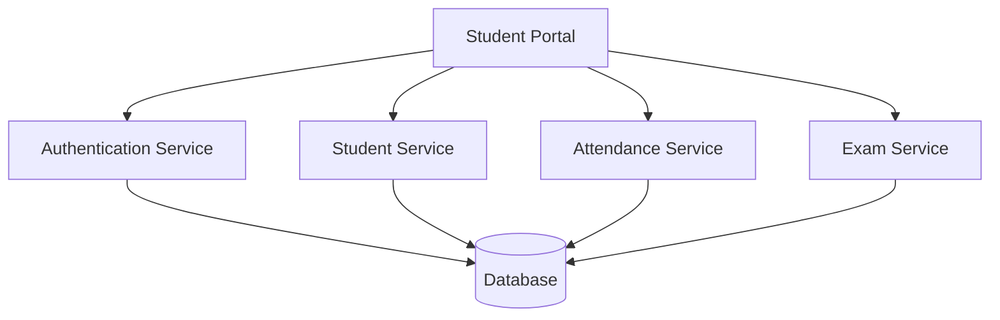

# College Management System - Microservices Documentation

## Table of Contents

1. [Architecture Overview](#architecture-overview)
2. [Service Descriptions](#service-descriptions)
3. [Deployment Process](#deployment-process)
4. [CI/CD Pipeline](#cicd-pipeline)
5. [Environment Variables](#environment-variables)
6. [Monitoring and Logging](#monitoring-and-logging)
7. [Troubleshooting Guide](#troubleshooting-guide)

---

# Architecture Overview

The College Management System is designed using a microservices architecture. Each service performs a specific function and communicates through REST APIs.



---

# Service Descriptions

| Service Name | Responsibility |
|-------------|---------------|
| Authentication Service | User login and access control |
| Student Service | Student profile management |
| Attendance Service | Attendance tracking |
| Exam Service | Examination records and results |

---

# Deployment Process

1. Pull latest code from repository.
2. Build Docker images.
3. Deploy services.
4. Verify service health.

```bash
git pull origin main

docker build -t student-service .

docker-compose up -d
```

---

# CI/CD Pipeline

The project uses GitHub Actions for automated deployment.

```yaml
name: College Management CI

on:
  push:
    branches:
      - main

jobs:
  build:
    runs-on: ubuntu-latest

    steps:
      - uses: actions/checkout@v4

      - name: Build Project
        run: echo "Build Successful"
```

---

# Environment Variables

| Variable | Description |
|----------|-------------|
| DB_HOST | Database host address |
| DB_USER | Database username |
| DB_PASSWORD | Database password |
| PORT | Application port number |

---

# Monitoring and Logging

- Application logs are collected centrally.
- Error logs are monitored continuously.
- Health checks run every 5 minutes.
- Performance metrics are tracked.

---

# Troubleshooting Guide

## Common Issues

### Service Not Starting

```bash
docker ps
docker logs student-service
```

### Database Connection Failure

```bash
ping database-server
```

---

## Project Structure

```text
college-management-system/
│
├── auth-service/
├── student-service/
├── attendance-service/
├── exam-service/
├── database/
└── docker-compose.yml
```