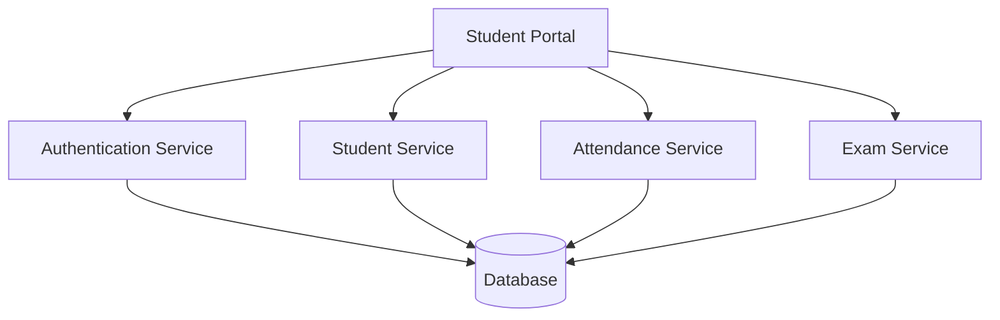
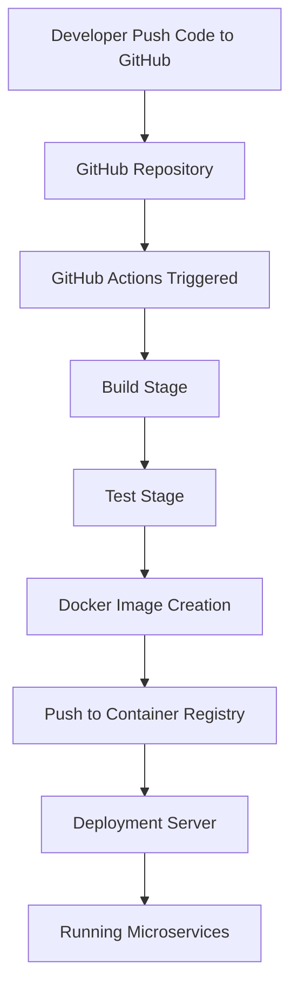

# College Management System - Microservices Documentation

## Table of Contents

1. [Architecture Overview](#architecture-overview)
2. [Components](#components-descriptions)
3. [Service Descriptions](#service-descriptions)
4. [Deployment Process](#deployment-process)
5. [CI/CD Pipeline](#cicd-pipeline)
6. [Environment Variables](#environment-variables)
7. [Monitoring and Logging](#monitoring-and-logging)
8. [Troubleshooting Guide](#troubleshooting-guide)
9. [Project Structure](#project-structure)
10. [Folder Structure](#folder-description)

---

## Architecture Overview

The College Management System follows a microservices architecture where each service is independently deployable and responsible for a specific business function. Services communicate through REST APIs, ensuring scalability, maintainability, and easier deployment.


---
## Components


| Component              | Description |
| ---------------------- | ----------- |
| Student Portal         | Web interface used by students to access services and information |
| Authentication Service | Manages login, registration, authentication, and authorization |
| Student Service        | Handles student records, profiles, and personal information |
| Attendance Service     | Records and manages student attendance data |
| Exam Service           | Manages exams, schedules, marks, and results |
| Database               | Stores application and academic data securely |
| Monitoring System      | Tracks application health, performance, and uptime |
| Logging System         | Collects and stores logs for troubleshooting and auditing |
| Docker Environment     | Provides containerized deployment for all services |
| GitHub Actions         | Automates build, testing, and deployment processes |


---

## Service Descriptions

| Service Name           | Responsibility                                |
| ---------------------- | --------------------------------------------- |
| Authentication Service | Handles user authentication and authorization |
| Student Service        | Manages student profiles and records          |
| Attendance Service     | Tracks and stores attendance information      |
| Exam Service           | Maintains examination schedules and results   |

### Service Communication

All services communicate through REST APIs and share data through a centralized database layer.


---

## Deployment Process

The deployment process ensures all services are updated and running correctly.

### Steps

1. Pull the latest code from the repository.
2. Build Docker images for each service.
3. Deploy containers using Docker Compose.
4. Verify service availability and health.

### Github Commands

```bash
git pull origin main

docker build -t student-service .

docker-compose up -d

docker-compose ps
```


---

## CI/CD Pipeline

The project uses GitHub Actions to automate build and deployment tasks whenever code is pushed to the main branch.

```yaml
name: College Management CI

on:
  push:
    branches:
      - main

jobs:
  build:
    runs-on: ubuntu-latest

    steps:
      - uses: actions/checkout@v4

      - name: Build Project
        run: echo "Build Successful"
```

### Pipeline Workflow

This diagram shows how code moves from development to deployment using CI/CD pipeline.




---

## Environment Variables

| Variable    | Description             |
| ----------- | ----------------------- |
| DB_HOST     | Database host address   |
| DB_USER     | Database username       |
| DB_PASSWORD | Database password       |
| PORT        | Application port number |

### Example Configuration

```env
DB_HOST=localhost
DB_USER=admin
DB_PASSWORD=password123
PORT=8080
```


---

## Monitoring and Logging

To ensure system reliability, monitoring and logging mechanisms are implemented across all services.

### Monitoring Features

* Centralized application logging
* Continuous error monitoring
* Health checks every 5 minutes
* Performance metric tracking
* Service uptime monitoring

### Logging Levels

| Level   | Purpose                              |
| ------- | ------------------------------------ |
| INFO    | General application events           |
| WARNING | Potential issues                     |
| ERROR   | Service failures                     |
| DEBUG   | Detailed troubleshooting information |


---

## Troubleshooting Guide

### Common Issues

#### Service Not Starting

```bash
docker ps
docker logs student-service
```

#### Database Connection Failure

```bash
ping database-server
```

#### Container Health Check

```bash
docker inspect student-service
```

### Recommended Actions

* Verify Docker services are running.
* Check database connectivity.
* Review application logs.
* Restart affected services if necessary.


---

## Project Structure

```text
college-management-system/
│
├── auth-service/
├── student-service/
├── attendance-service/
├── exam-service/
├── database/
├── monitoring/
├── logs/
└── docker-compose.yml
```

### Folder Structure

* **auth-service/** - Authentication and authorization logic
* **student-service/** - Student management functionality
* **attendance-service/** - Attendance tracking service
* **exam-service/** - Examination and result processing
* **database/** - Database configuration files
* **monitoring/** - Monitoring tools and configurations
* **logs/** - Application log files


